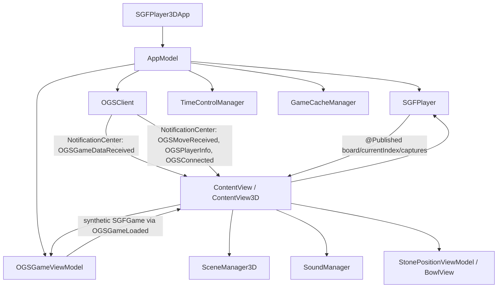

# SGFPlayer3D Project Map

Last reviewed: 2026-08-03

This document maps the current SGFPlayer3D architecture at a practical level: what owns state, how OGS data flows into the board, where rendering and side effects happen, and where architectural risk is concentrated. It is based on a source-level pass, not a full line-by-line audit.

## Current Orientation

The active app is:

`/Users/Dave/SGFPlayer/SGFPlayer3D/SGFPlayer3D.xcodeproj`

The git repo root is:

`/Users/Dave/SGFPlayer`

Current branch at review time:

`refactor/clean-architecture-for-chat`, 4 commits ahead of `origin/refactor/clean-architecture-for-chat`.

Primary scheme:

`SGFPlayer3D`

The app is a macOS SwiftUI app with two board presentations:

- `ContentView`: 2D board path.
- `ContentView3D`: 3D SceneKit board path.

Both views share central state through `AppModel`.

## High-Level Shape

The most important architectural fact: OGS game state is not represented as a first-class domain model all the way to the board. OGS data is fetched/received, normalized into a generated SGF string, parsed back into `SGFGame`, loaded into `SGFPlayer`, then rendered by the existing SGF playback engine.

That reuse is pragmatic, but it makes it harder to separate:

- server-authoritative OGS state
- optimistic local moves
- polling reloads
- local SGF playback
- visual effects such as sounds and captured stones

## Core Modules

### App Entry

`SGFPlayer3D/SGFPlayer3DApp.swift`

Creates one `AppModel` as a `@StateObject`, then switches between `ContentView` and `ContentView3D` based on `app.viewMode`.

The app currently defaults to a hidden title bar and content-sized window. Debug file logging is initialized here.

### AppModel

`SGFPlayer3D/AppModel.swift`

This is the central composition root and shared state owner. It owns:

- local SGF folder URL and parsed games
- selected game
- active playlist
- `GameCacheManager`
- shared `SGFPlayer`
- shared `OGSClient`
- shared `TimeControlManager`
- shared `OGSGameViewModel`
- pre-game overlay flag

For local SGF files, `AppModel` recursively loads `.sgf` files, parses them through `SGFParser`, wraps them as `SGFGameWrapper`, and loads selected games into the shared `SGFPlayer`.

Architectural note: `AppModel` is doing composition, persistence, local file loading, audio setup, and OGS object creation. It is a reasonable current hub, but it is also broad enough that future refactoring should keep it as a coordinator, not a place for more domain logic.

### SGF Parser and Game Model

`SGFPlayer3D/SGFKit.swift`

Defines:

- `SGFTree`
- `SGFNode`
- `SGFParser`
- `SGFGame`

Parser characteristics:

- lightweight
- main-line only
- ignores variations
- supports setup stones through `AB` / `AW`
- supports move properties `B` / `W`
- supports common metadata

This is adequate for playback and OGS reconstruction, but not a complete SGF engine.

### Game Engine

`SGFPlayer3D/SGFPlayerEngine.swift`

Defines `SGFPlayer`, the board-state authority used by both local playback and OGS game display.

Publishes:

- `board`
- `lastMove`
- `isPlaying`
- `currentIndex`
- `lastCaptureCount`
- `blackCaptured`
- `whiteCaptured`

Responsibilities:

- load an `SGFGame`
- reset/clear board
- step forward/backward
- seek to a move
- apply moves
- calculate captures using liberties
- support suicide SGFs defensively
- optimistic move placement for OGS live play

Important detail: `blackCaptured` means stones captured by black; `whiteCaptured` means stones captured by white. The names are easy to misread as "black stones captured" and "white stones captured". Any bowl code must be explicit about this.

Risk area: `playMoveOptimistically` appends a local move into the same `_moves` array used for authoritative SGF/OGS loads. Later server polling reloads the game and overwrites this state. This may be acceptable, but it creates a race-sensitive area for duplicate move effects, false capture effects, and sound triggers.

### OGS Client

`SGFPlayer3D/OGSClient.swift`

This is the largest module and currently combines transport, auth, REST API, realtime messages, challenge/automatch work, parsing, logging, and event publication.

Observed endpoints/protocol:

- WebSocket: `wss://wsp.online-go.com/`
- Login: `https://online-go.com/api/v0/login`
- UI config/JWT: `https://online-go.com/api/v1/ui/config`
- Game fetch: `https://online-go.com/api/v1/games/{gameID}`
- Challenges: `https://online-go.com/api/v1/challenges`
- Realtime messages: `authenticate`, `game/connect`, `spectate`, `game/move`, undo, pass, resign

Published state includes:

- connection/auth flags
- username/player ID/rank
- current game ID
- OGS clock fields
- current player color
- local player color
- game phase
- automatch/challenge state

The client posts untyped notifications:

- `OGSConnected`
- `OGSDisconnected`
- `OGSGameDataReceived`
- `OGSMoveReceived`
- `OGSPlayerInfo`
- `OGSRateLimited`
- `OGSUndoRequested`
- `OGSUndoRejected`

Architectural risk: the app relies heavily on stringly-typed `NotificationCenter` events with dictionary payloads. This makes flow easy to wire quickly, but hard to reason about and test. It also means both 2D and 3D views duplicate event subscription logic.

### OGS Game View Model

`SGFPlayer3D/ViewModels/OGSGameViewModel.swift`

This module bridges OGS game data into the local SGF/game engine world.

Responsibilities:

- handle `OGSGameDataReceived`
- extract metadata such as komi/rules/player names/ranks
- create synthetic SGF content from OGS moves
- add handicap setup stones
- parse synthetic SGF back into `SGFGame`
- post `OGSGameLoaded`
- update turn/time control
- poll OGS REST game data
- handle throttling backoff

Critical architectural point: this is where OGS authoritative state becomes local SGF state.

Potential correctness risk: moves are assigned colors by alternating from black, or white when handicap is present. That may not cover all OGS/rules edge cases, undo, edited history, setup data, or pass-like moves unless the incoming OGS move payload is consistently normalized.

### Time Control

`SGFPlayer3D/TimeControlManager.swift`

Tracks black/white times, periods, period length, active player, and local countdown. It is updated from OGS clock fields and switched by `OGSGameViewModel`.

This is relatively isolated and has tests.

### 3D View

`SGFPlayer3D/ContentView3D.swift`

The 3D SwiftUI view is still a major coordinator despite extraction work.

It owns:

- `SceneManager3D`
- `SettingsViewModel`
- sound manager reference
- camera state
- playback state
- search state
- overlay state
- phantom stone state
- many event handlers

It responds to:

- `player.$currentIndex`
- app selection changes
- OGS connection/game/move/player/rate-limit notifications
- OGS game loaded notifications
- clock field changes
- fullscreen/app activation
- mouse and key events

Important path for OGS move display:

1. `OGSClient` receives/fetches OGS data.
2. `ContentView3D` forwards notification to `OGSGameViewModel`.
3. `OGSGameViewModel` posts `OGSGameLoaded`.
4. `ContentView3D` loads the generated `SGFGame` into `player`.
5. `ContentView3D` seeks to the OGS move count.
6. `player.$currentIndex` triggers `updateStonesWithJitter`.
7. `SceneManager3D.updateStones` rebuilds scene stone nodes.

Risk: `ContentView3D` mixes UI, OGS event routing, game loading, optimistic moves, sound, clock sync, search, camera, and rendering triggers. The recent extraction commits appear to be moving in the right direction, but the architecture is mid-refactor.

### 3D Scene

`SGFPlayer3D/SceneManager3D.swift`

Owns the SceneKit scene, camera, board geometry, stones, phantom stone, lighting, background, collision nudging, and last-move indicator.

Rendering model:

- board is recreated if board size changes
- all existing stone nodes are removed on update
- stones are recreated from `SGFPlayer.board`
- last-move indicator is applied based on `player.lastMove`

This module should ideally remain a pure renderer from board state plus view settings. At present, it is fairly renderer-focused, which is good.

### Captures, Bowls, and Sound

Relevant files:

- `SGFPlayerEngine.swift`
- `StonePositionViewModel.swift`
- `BowlView.swift`
- `PlayerCapturesAdapter.swift`
- `SoundManager.swift`
- `ContentView3D.swift`

Current capture state sources:

- `SGFPlayer.lastCaptureCount`
- `SGFPlayer.blackCaptured`
- `SGFPlayer.whiteCaptured`
- `StonePositionViewModel` target stone counts
- `PlayerCapturesAdapter`, which currently says it does not derive captured counts

`StonePositionViewModel.updateStonePositions` plays capture sound when new bowl stones are added. That means visual bowl deltas can trigger audio side effects.

This is likely the right area for the false capture bug. The first debugging question should be: when the false lid stone appears, does `SGFPlayer.blackCaptured` or `SGFPlayer.whiteCaptured` actually increase? If yes, the issue is model/state reconstruction. If no, the issue is bowl/physics/UI diffing.

Architectural risk: capture sounds are currently downstream of bowl layout changes, not directly downstream of a validated move/capture event. That can produce false positives if the bowl view model thinks a stone was added due to reload, reset, stale cache, wrong target count, or count interpretation.

### 2D View

`SGFPlayer3D/ContentView.swift`

The 2D path mirrors many of the same OGS notifications as `ContentView3D`. It has similar event-routing responsibilities.

Risk: duplicated OGS event handling in 2D and 3D can diverge. If OGS is meant to be view-independent, the OGS event handling should move below both views.

### Settings and Overlays

Relevant files:

- `SettingsViewModel.swift`
- `SettingsPanelView.swift`
- `SettingsPanelView3D.swift`
- `PreGameOverlay.swift`
- recently extracted view files such as `TopButtonsView`, `PhysicsOverlayView`, `GameInfoAndControlsView`

This area is mid-refactor. Recent commits show extraction from large views, but state ownership is not yet cleanly centralized.

### Cache and Physics

Relevant files:

- `GameStateCache.swift`
- `CacheManager.swift`
- `PhysicsEngine.swift`
- `GroupDropPhysicsModel.swift`
- `SpiralPhysicsModel.swift`
- `EnergyMinimizationModel.swift`
- `BowlPhysics.swift`
- `StoneJitter.swift`

The cache layer can precompute board/capture/bowl/jitter state, but background full pre-calculation is currently disabled to avoid crashes with large folders.

There are at least two capture calculation approaches:

- direct incremental capture counts in `SGFPlayer`
- derived counts by comparing expected stones vs current stones in `GameStateCache`

This is another architecture pressure point. One authoritative capture source would reduce bug risk.

## Tests

Current tests are light:

- `OGSGameViewModelTests.swift`
- `TimeControlManagerTests.swift`
- placeholder `SGFPlayer3DTests.swift`

Coverage gaps:

- no direct tests for `SGFPlayer` capture logic
- no tests for OGS move-list to `SGFGame` conversion edge cases
- no tests for optimistic move followed by authoritative reload
- no tests for duplicate polling events and sound/capture side effects
- no tests for handicap/pass/undo/capture-count handling

The fastest useful test additions would be pure unit tests around `SGFPlayer` and `OGSGameViewModel` with small board positions.

## Duplicate and Stale Files

There are two `OGSClient.swift` files:

- `/Users/Dave/SGFPlayer/SGFPlayer3D/OGSClient.swift`
- `/Users/Dave/SGFPlayer/SGFPlayer3D/SGFPlayer3D/OGSClient.swift`

They are not identical. The app target appears to use the nested file in `SGFPlayer3D/OGSClient.swift`.

Several docs reference an older path:

`/Users/Dave/Go/SGFPlayer Code/SGFPlayer3D`

That path did not appear to contain the active project during this review. Treat docs with that path as stale unless verified.

## Main Architecture Risks

1. OGS transport, REST, auth, parsing, challenges, and event publication are concentrated in a single very large `OGSClient`.

2. OGS state is communicated with string-based notifications and dictionary payloads. This is flexible but brittle.

3. Both `ContentView` and `ContentView3D` subscribe to OGS notifications directly. This makes views responsible for application flow.

4. OGS game data is converted into synthetic SGF and then reparsed. This reuses the local engine but obscures OGS-specific semantics.

5. Optimistic moves mutate the same `SGFPlayer` state that authoritative reloads later replace.

6. Capture side effects appear to be tied to bowl layout changes, not a single validated capture event.

7. There are multiple concepts of capture count and bowl state across engine, cache, adapter, and view model.

8. Stale docs and duplicate source files increase the chance of editing or debugging the wrong artifact.

## Suggested Refactor Direction

Do not rewrite everything first. Stabilize the current architecture in layers:

1. Define an authoritative `GameSession` concept:
   - local SGF session
   - OGS live session
   - OGS review/spectate session

2. Move OGS notification handling out of `ContentView` and `ContentView3D` into a shared coordinator/view model.

3. Give OGS game state a typed model before converting to SGF:
   - game ID
   - board size
   - players
   - phase
   - clock
   - moves
   - captures if available
   - local player color

4. Make `SGFPlayer` or a new `GameRulesEngine` the single source for board and capture state.

5. Make capture audio and bowl animation respond to explicit, validated capture deltas:
   - previous authoritative capture counts
   - next authoritative capture counts
   - move identity / game ID
   - ignore pure reloads with unchanged move count

6. Keep `SceneManager3D` as a renderer from state, not an owner of game flow.

7. Add pure unit tests before broad changes:
   - basic captures
   - no-capture moves
   - suicide or illegal defensive cases
   - handicap first-move color
   - pass moves
   - optimistic move plus same authoritative move
   - repeated polling with unchanged move count should not trigger sound or bowl changes

## Debugging Plan for False Capture Bug

Instrument one move path before changing behavior:

1. Log before and after every `SGFPlayer.apply`:
   - game ID if known
   - move index
   - color and coordinate
   - captured count for that move
   - total `blackCaptured` and `whiteCaptured`
   - board stone count

2. Log every bowl update:
   - current move
   - target black/white capture counts
   - previous black/white bowl counts
   - new black/white bowl counts
   - whether sound was triggered

3. Log OGS reload identity:
   - game ID
   - previous loaded move count
   - new move count
   - whether this is a poll, websocket event, or optimistic local move

4. Reproduce the issue and classify it:
   - engine says capture happened: investigate SGF/OGS move reconstruction or rules logic
   - engine says no capture, bowl changes: investigate bowl count source/cache/diffing
   - no model or bowl change, only sound: investigate sound trigger path

## Immediate Next Steps

1. Clean up source-of-truth confusion:
   - confirm the nested `SGFPlayer3D/OGSClient.swift` is the target file
   - either remove/archive the root duplicate or document it as stale

2. Add focused logging around capture deltas.

3. Add unit tests for capture/no-capture behavior in `SGFPlayer`.

4. Add a typed OGS game-state model or coordinator before making large OGS changes.

5. Continue extracting event routing out of the two content views.

